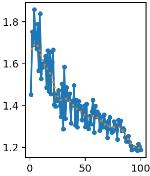
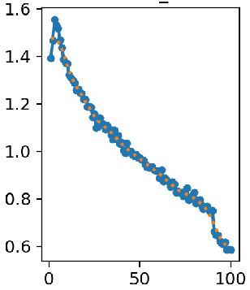

# YOLOv12n Door Handle Detection

This project fine-tunes a pretrained **YOLOv12n** model to detect **indoor/outdoor door handles**, **drawers**, and **vehicle handles**. The dataset includes open-source images from **Roboflow** and a custom-labeled set of vehicle door handles.

---

## YOLOv12n Model

We use the official YOLOv12 implementation:

 [YOLOv12 Repository](https://github.com/sunsmarterjie/yolov12/tree/main)

The environment setup and requirements are kept consistent with the original repo.

---

## Dataset

- **Door Handle Dataset** (Roboflow):  
  https://universe.roboflow.com/re-yj1gy/door-handle-lever-type

- **Vehicle Door Handle Dataset** (Roboflow only for images):  
  https://universe.roboflow.com/kukabot/puerta-kkpo9

- **Custom Images**:  
  +84 manually labeled car door handle images for better generalization.

---

## Training Details

We use **transfer learning** by freezing the backbone layers up to layer 6. The attention modules (neck and head) are kept **trainable** to adapt the model to new data.

| Parameter       | Value       |
|----------------|-------------|
| Learning Rate   | 0.001       |
| Batch Size      | 16          |
| Image Size      | 640 x 640   |
| Epochs          | 100         |

---

## Model Evaluation

| Metric               | Value     |
|----------------------|-----------|
| **Precision**        | 0.88006   |
| **Recall**           | 0.67241   |
| **F1 Score**         | 0.7762    |
| **mAP@0.5**          | 0.76114   |

- **Validation Loss Over Epochs**:  
  

- **Training Loss Over Epochs**:  
  

